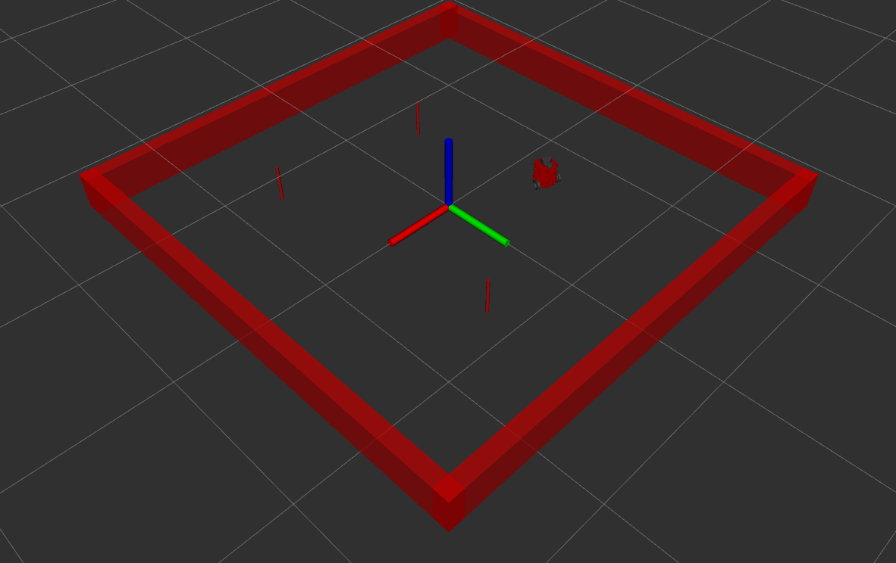

# Nusim Description
This package contains functionality to simulate the navigation of Nuturtle turtlebot *Salamandroid* (see package nuturtle_description). Functionaltiy is currently confined to placing the *Salamandroid* in a rectangular arena with cylindrical obstacles.

`ros2 launch nusim nusim.launch.xml` launches rviz, showing the *Salamandroid* in the default (3 meter square) arena with the default obstacles (three very thin cylinders).



Here is the rqt graph when the `nusim.launch.xml` is run with default settings.


# Launch File Details
You may specify dimensions of arena, locations and radii of the cylindrical obstacles, and initial position of the *Salamandroid* by supplying a yaml file as the `config_file` argument to `nusim.launch.xml`. You may use `basic_world.yaml` as a model for the format and parameter names.

## Nusim Parameters:
* `arena_x_length`, `arena_y_length`: The x and y dimension of the arena, in meters
* `obstacles.x`, `obstacles.y`: Lists of the x and y coordinates of cylindrical obstacles to place in the arena. The provided lists **shall** be the same length
* `obstacles.r`: The radius of all cylindrical obstacles
* `x0`, `y0`, `theta0`: The initial position of the *Salamandroid* relative to the center of the arena.

## `nusim.launch.xml` Arguments
Only the `config_file` argument is valid for `nusim.launch.xml`, the other arguments are cascaded in from included launch files.

`ros2 launch nusim nusim.launch.xml -s`
```
Arguments (pass arguments as '<name>:=<value>'):

    'config_file':
        What yaml file to load obstacle and turtlebot initial positions from.
        (default: 'basic_world.yaml')

    'use_rviz':
        True will open rviz, False will not open rviz
        (default: 'True')

    'use_jsp':
        True will use joint_state_publisher, False will not use joint_state_publisher
        (default: 'True')

    'color':
        What color do you want your turtle to be?. Valid choices are: ['purple', 'red', 'green', 'blue']
        (default: 'purple')
```