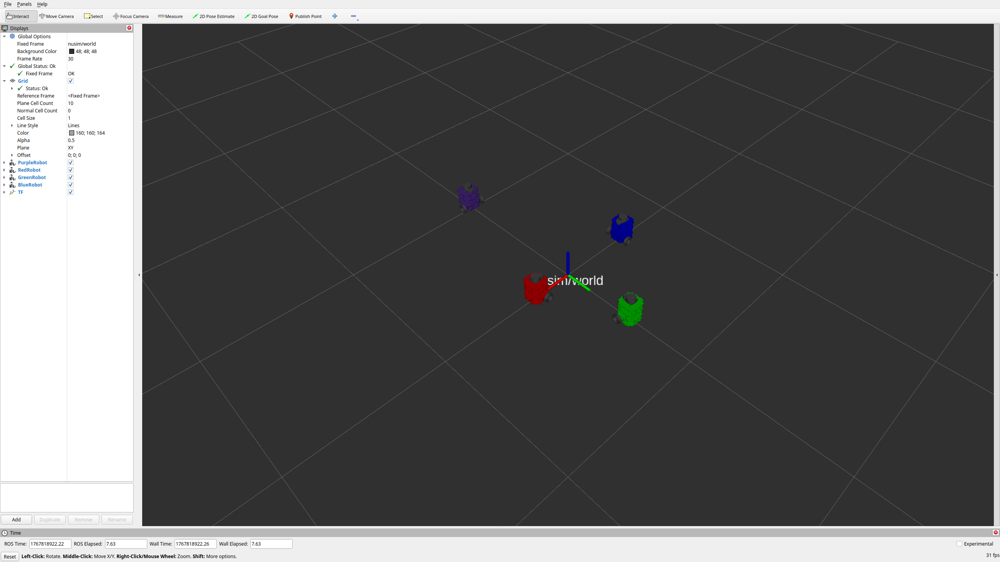

# Nurtle  Description
URDF files for Nuturtle *Salamandroid*
* `ros2 launch nuturtle_description load_one.launch.xml` to see the robot in rviz.
* `ros2 launch nuturtle_description load_all.launch.xml` to see four copies of the robot in rviz.

* The rqt_graph when all four robots are visualized (Nodes Only, Hide Debug) is:


# Launch File Details
* `ros2 launch nuturtle_description load_one.launch.xml -s`
  ```
  Arguments (pass arguments as '<name>:=<value>'):

    'use_rviz':
        True will open rviz, False will not open rviz
        (default: 'True')

    'use_jsp':
        True will use joint_state_publisher, False will not use joint_state_publisher
        (default: 'True')

    'color':
        What color do you want your turtle to be?. Valid choices are: ['purple', 'red', 'green', 'blue']
        (default: 'purple')
  ```
* `ros2 launch nuturtle_description load_all.launch.xml -s`
  ```
  Arguments (pass arguments as '<name>:=<value>'):

    'use_rviz':
        True will open rviz, False will not open rviz
        (default: 'True')

    'use_jsp':
        True will use joint_state_publisher, False will not use joint_state_publisher
        (default: 'True')

    'color':
        What color do you want your turtle to be?. Valid choices are: ['purple', 'red', 'green', 'blue']
        (default: 'purple')
  ```